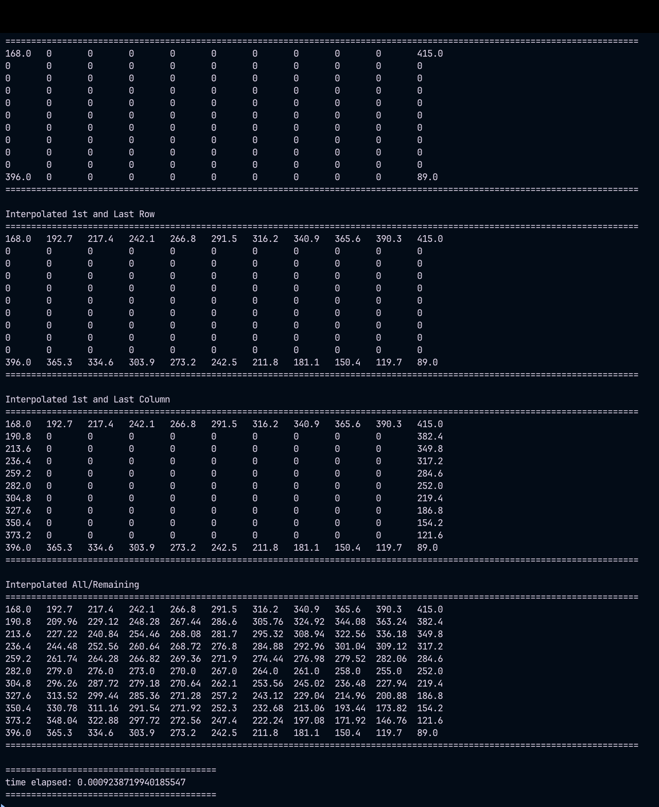
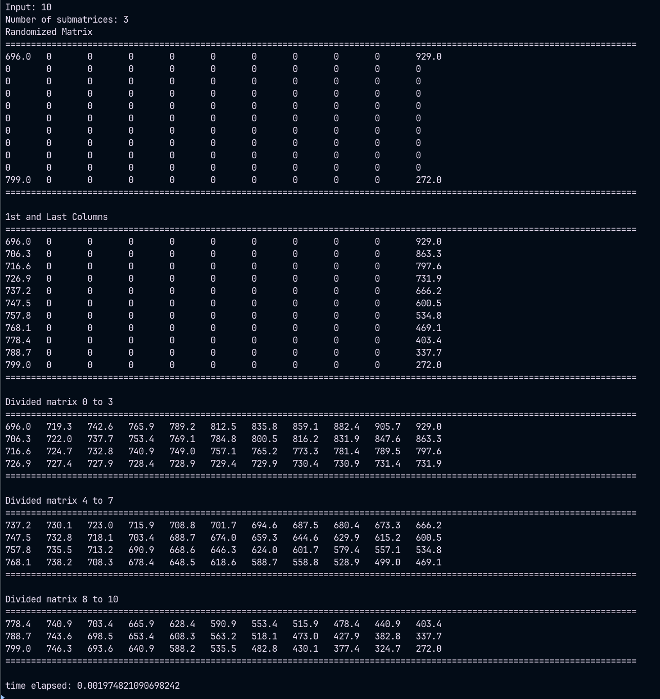
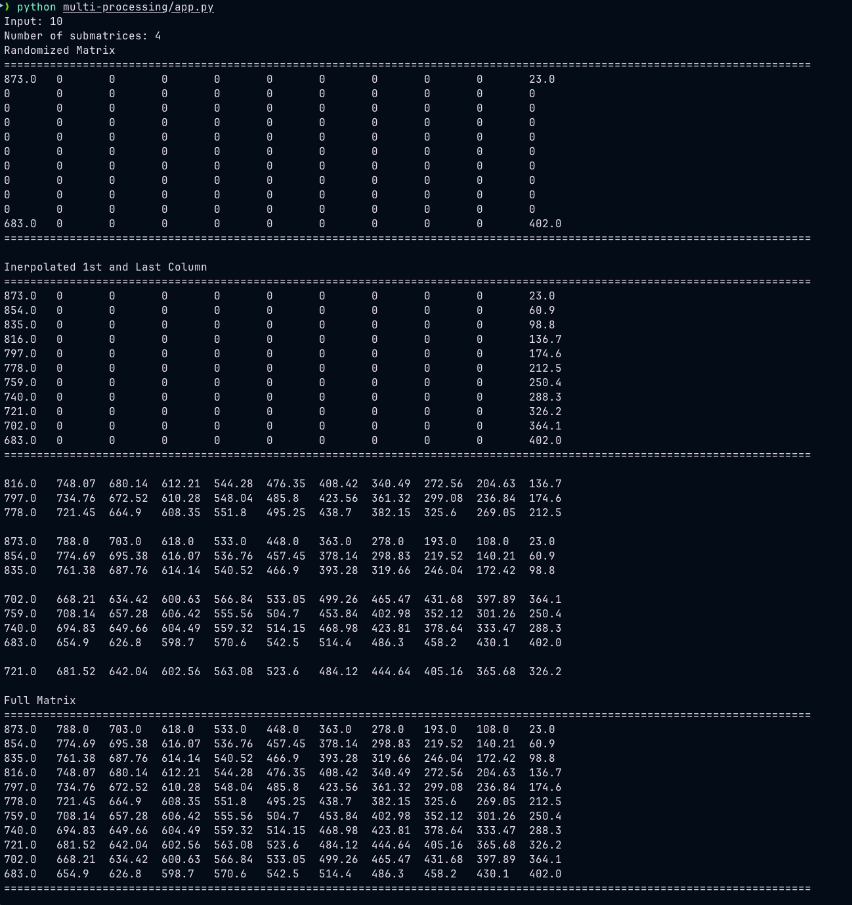

# Parallel Programming Exercise

## Table of Contents
- [Base](#interpolating-elevations-base)
- [Multi-Threading](#runtime-efficient-threaded-interpolating-elevation-multi-threading)
- [Multi-Processing]()

## Interpolating Elevations Base
- Interpolating the elevations into a higher resolution digital elevation matrix M given a lower resolution digital elevation matrix N
- Interpolating the unknown elevation of all the grid points of a n x n matrix M. Randomizing
the elevation of grid points that are divisible by 10.

[Discussion/Paper](./assets/pdfs/base.pdf)

How to Run The Program:
`python3 app.py`
`python /base/app.py`

## Runtime-efficient Threaded Interpolating elevation (Multi-threading)
- Extended version of Base Interpolation
- Use of threads to estimate the point elevation of n x n matrix.
- Transform faster serial computer program into a threaded computer program.

[Discussion/Paper](./assets/pdfs/multithreading.pdf)

How to Run The Program:
`python /multi-threaded/app.py`

## Runtime-efficient Threaded Interpolating elevation and Core-affine Threaded Computation of Interpolating Elevation

[Discussion/Paper](./assets/pdfs/multiprocessing.pdf)

How to Run The Program:
`python /multi-processing/app.py`

## Distributing Parts of a Matrix over Sockets
[Discussion/Paper](./assets/pdfs/socket.pdf)

How to Run The Program:
`python /socket/main.py`